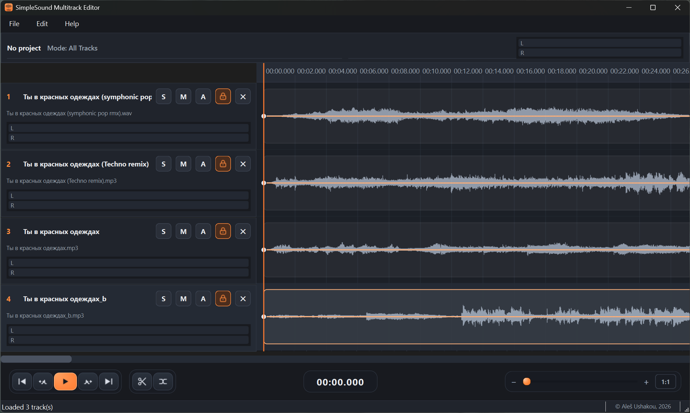

# SimpleSound

A lightweight multitrack audio editor. Load several tracks, align them, cut and fade, and play the result back in real time.

<p align="center">
  
</p>

---

## Features

- **Multitrack editing** — load multiple WAV / MP3 / FLAC / OGG / M4A files, each as a separate track.
- **Non-destructive segments** — cut, move and trim segments without touching the source audio. Drag the body to reposition, drag the edge to trim.
- **Segment lock** — per-track lock (and global `L` shortcut) protects segments from accidental drags; locked by default.
- **Peak jump** — step the playhead between loud peaks in the waveform via `Shift + Space` / `Ctrl + Shift + Space`.
- **Volume automation** — draw gain envelopes per track with `Ctrl + Click` to add points and drag to shape them.
- **Close gaps** — multi-select segments and press `M` to slide right segments flush against the left one (keeps them as separate segments).
- **Real-time playback** via PortAudio with low-latency metering (per-track + master, L/R peak-and-RMS meters).
- **Solo / Mute** per track, number keys `1…9` for quick solo.
- **Undo / Redo** with full project snapshots.
- **Project save/load** (`.ssproj`, JSON format — references audio files by path).


---

## Screenshot

<p align="center">
  
</p>

---

## Installation

### Requirements

- Python 3.10+
- [FFmpeg](https://ffmpeg.org/) on `PATH` (required by `pydub` to decode MP3/M4A/OGG)

### Install

```bash
git clone https://github.com/AlesUshakou/SimpleSound.git
cd SimpleSound
python -m venv .venv
source .venv/bin/activate         # Windows: .venv\Scripts\activate
pip install -r requirements.txt
```

### Run

```bash
python main.py
```

---

## `requirements.txt`

```
PySide6>=6.6
numpy>=1.24
pydub>=0.25
sounddevice>=0.4
```

---

## Keyboard shortcuts

| Category | Shortcut | Action |
| --- | --- | --- |
| Transport | `Space` | Play / Pause |
| Transport | `Shift + Space` | Jump to next peak (right of playhead) |
| Transport | `Ctrl + Shift + Space` | Jump to previous peak (left of playhead) |
| Transport | `Home` / `End` | Jump to start / end |
| Transport | `1` … `9` | Solo track N |
| Editing | `C` | Cut at playhead |
| Editing | `M` | Close gaps between selected segments |
| Editing | `L` | Toggle segment lock on all tracks |
| Editing | `Delete` | Delete selection / segment / automation point |
| Editing | `Ctrl + C` / `Ctrl + V` | Copy / Paste |
| Editing | `Ctrl + Z` / `Ctrl + Shift + Z` | Undo / Redo |
| View | `Ctrl + Wheel` | Zoom around playhead |
| View | `Shift + Wheel` | Horizontal scroll |
| View | `0` | Reset zoom |
| Project | `Ctrl + O` | Open audio files |
| Project | `Ctrl + Shift + O` | Open project |
| Project | `Ctrl + S` | Save project |
| Project | `Ctrl + Shift + S` | Save project as... |
| Help | `F1` | Help & Shortcuts dialog |

Full list is available in-app via **Help → Help & Shortcuts** (or `F1`).

---

## Mouse

- **Click** on the waveform — move the playhead.
- **Click + drag** — create a time selection.
- **Ctrl + Click** on a track — add an automation point.
- **Drag an automation point** — move it.
- **Shift + Click** on a segment — add it to multi-selection.
- **Double-click** on a segment — select / deselect it.
- **Drag segment body** — move it along the timeline (unlocked only).
- **Drag segment edge** — trim it (unlocked only).
- **Right-click** — context menu (add automation point, delete, merge, etc.).


---

## How playback works

SimpleSound mixes all active tracks in a PortAudio callback at 48 kHz / stereo / float32. Each track is represented as a list of non-overlapping `TrackSegment`s pointing into the source audio buffer (`source_start` offset), and a piecewise-linear volume automation curve. The callback, for each block:

1. Resolves which segments of each track overlap the current time window.
2. Copies the relevant samples from the source buffer.
3. Multiplies by the interpolated automation gain (vectorised with NumPy).
4. Sums all tracks and clips to `[-1, 1]`.
5. Computes peak + RMS per track and master for the meters.

Because segments are just views into the original audio with a time offset, cutting, moving, and trimming are instant and non-destructive.

---

## Release notes

### 14 April 2026

**UI pass: redesigned bottom transport bar, segment lock, peak jump, empty-state canvas.**

#### New features

- **Segment lock.** Each track header now has a lock button (SVG icon). Locked by default to prevent accidental segment moves or trims while navigating. Press `L` to toggle lock on all tracks at once. While locked, hand and resize cursors are hidden over segments, and drag / trim are disabled.
- **Peak jump.** Two new buttons flank the Play button: jump to the previous / next loud peak in the waveform. Shortcuts: `Shift + Space` (next), `Ctrl + Shift + Space` (previous). Works across all loaded tracks, using mipmap data with an adaptive 92nd-percentile threshold and distance-weighted scoring.
- **Empty state.** With no tracks loaded, the timeline ruler and playhead are hidden. The canvas shows a subtle grid and a centred *"Drag & drop audio files here"* badge instead.
- **Separate About entry.** Help menu now has two items: **Help & Shortcuts** (`F1`) and **About SimpleSound**. Both open the same dialog; About opens it directly on the About tab.

#### Redesign

- **Bottom transport bar.** Redesigned in a studio style with three dark capsule groups, gradient backgrounds, and accent glow on hover. New layout: `[transport + edit] ← stretch → [time display] ← stretch → [zoom]`.
- **Play button** squared off (10 px radius), sized to match the transport row.
- **Time display** moved from the top bar to the bottom centre, styled as an LCD-style readout.
- **Zoom slider** with gradient sub-page and glowing handle, plus a `1:1` reset button.
- **All transport icons** replaced with inline SVG — crisp at any DPI, easily recolourable.
- **Copyright link** in the status bar: fixed stray underline that Qt's rich-text renderer added despite the stylesheet.

#### New shortcuts

| Shortcut | Action |
| --- | --- |
| `Shift + Space` | Jump to next peak |
| `Ctrl + Shift + Space` | Jump to previous peak |
| `L` | Toggle segment lock on all tracks |

---

## License

MIT © 2026 [Aleš Ushakou](https://www.linkedin.com/in/ales-ushakou)

---

## Acknowledgements

- [PySide6](https://doc.qt.io/qtforpython-6/) — Qt for Python
- [sounddevice](https://python-sounddevice.readthedocs.io/) / PortAudio — real-time audio I/O
- [pydub](https://github.com/jiaaro/pydub) + FFmpeg — audio decoding
- [NumPy](https://numpy.org/) — the mixer's number cruncher
